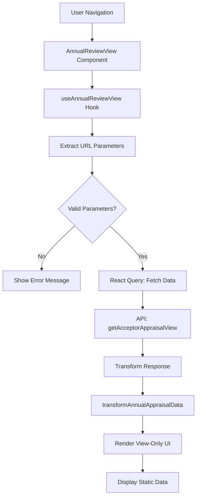

# Design Document: Annual Review View-Only Interface

## Overview

The Annual Review View-Only feature provides a read-only interface for viewing completed annual appraisals. This feature allows authorized users to reference historical performance data without the risk of accidental modifications. The design leverages existing components and patterns from the editable Annual Review interface while ensuring all interactive elements are disabled or replaced with static displays.

### Key Design Goals

1. **Data Integrity**: Ensure no modifications can be made to historical appraisal data
2. **Consistency**: Maintain visual and structural consistency with the editable interface
3. **Reusability**: Leverage existing components and transformers where possible
4. **Performance**: Efficient data fetching and rendering using React Query
5. **User Experience**: Clear visual indicators of read-only mode

## Architecture

### Component Structure

```
AnnualReviewView (Main Component)
├── useAnnualReviewView (Custom Hook)
│   ├── React Query (Data Fetching)
│   ├── URL Parameter Extraction
│   └── Data Transformation
├── BackButton
├── CheckInDescriptionSection (Employee Context)
├── FinalScoreSummaryTable (Score Summary)
├── KRA Display Sections
│   ├── Non-Measurable KRAs (Grouped)
│   │   ├── Static Score Badges
│   │   └── Read-Only Comment Sections
│   └── Measurable KRAs (if present)
└── Development Inputs Sections
    ├── Overall Development (Read-Only)
    ├── Authority Remarks (Read-Only)
    └── Option-Based Questions (Static Indicators)
```

### Data Flow



## Components and Interfaces

### 1. AnnualReviewView Component

**Purpose**: Main component that renders the view-only annual review interface

**Props**: None (uses URL parameters and location state)

**State**: None (all state managed by custom hook)

**Key Features**:
- Renders all appraisal data in read-only format
- Displays visual indicators for view-only mode
- Uses existing UI components where possible
- Handles loading and error states

### 2. useAnnualReviewView Hook

**Purpose**: Custom hook for data fetching and state management

**Returns**:
```typescript
{
  data: TransformedAppraisalData | null,
  developmentInputs: DevelopmentInputs,
  isLoading: boolean,
  isError: boolean,
  context: {
    employee: EmployeeInfo,
    financialYear: string,
    quarter: string,
    appraisalPeriod: string,
    dateRange: string,
    metadata: MetadataInfo
  }
}
```

**Key Features**:
- Extracts parameters from URL search params or location state
- Validates required parameters before API calls
- Uses React Query for caching and state management
- Transforms API response using existing transformer
- No form state or mutation functions

### 3. API Integration

**Endpoint**: `GET /appraisal/acceptor_appraisal/view`

**Query Parameters**:
- `empNo`: Employee number (required)
- `url`: URL identifier (required)
- `zoneName`: Zone name (required)
- `roleType`: Role type (required)
- `financialYear`: Financial year (required)
- `quarter`: Quarter (required)

**Headers**:
- `Authorization`: Bearer token
- `accept`: */*

**Response Structure**: Same as editable endpoint (see API response format in requirements)

### 4. Service Layer

**New Function**: `appraisalAPI.getAcceptorAppraisalView(params)`

```javascript
getAcceptorAppraisalView: (params) => {
  return apiClient.get('/appraisal/acceptor_appraisal/view', {
    params: {
      empNo: params.empNo,
      url: params.url,
      zoneName: params.zoneName,
      roleType: params.roleType,
      financialYear: params.financialYear,
      quarter: params.quarter,
    },
  });
}
```

## Data Models

### TransformedAppraisalData

```typescript
interface TransformedAppraisalData {
  finalScoreSummary: FinalScoreItem[];
  nonMeasurableKras: Record<string, NonMeasurableKRA[]>;
  measurableKras: MeasurableKRA[];
  totalNonMeasurableActual: number;
  totalNonMeasurableMax: number;
  totalMeasurableActual: number;
  totalMeasurableMax: number;
  metadata: AppraisalMetadata;
  isReadOnly: boolean;
  unitConverter: string;
  validationMessage: string;
}
```

### NonMeasurableKRA

```typescript
interface NonMeasurableKRA {
  KraId: number;
  KraCode: number;
  KraName: string;
  KraDescription: string;
  MaxScore: number;
  // Scores from all roles
  AppraiseeActual: number | null;
  AppraiserActual: number | null;
  ReviewerActual: number | null;
  AcceptorActual: number | null;
  RepaActuals: number | null;
  RevaActuals: number | null;
  AcActuals: number | null;
  // Comments from all roles
  CommentSelf1: string;
  CommentSelf2: string;
  CommentRepa: string;
  CommentReva: string;
  CommentAc: string;
  // Metadata
  Tooltip: string;
  IsEditable: boolean;
  IsActive: boolean;
}
```

### DevelopmentInputs

```typescript
interface DevelopmentInputs {
  overallDevelopment: DevelopmentQuestion[];
  reportingReviewAuthority: DevelopmentQuestion[];
  optionBased: OptionBasedQuestion[];
}

interface DevelopmentQuestion {
  id: number;
  question: string;
  category: string;
  subCategory: string;
  selfResponse: string;
  selfResponse2?: string;
  repaResponse: string;
  revaResponse: string;
  acResponse: string;
  editableBy: 'APPRAISEE' | 'REVIEWER_ACCEPTOR';
}

interface OptionBasedQuestion {
  id: number;
  key: string;
  question: string;
  options: Array<{ value: string; label: string }>;
  selfResponse: string;
  repaResponse: string;
  revaResponse: string;
  acResponse: string;
  editableBy: 'APPRAISEE' | 'REVIEWER_ACCEPTOR';
}
```

## Correctness Properties

*A property is a characteristic or behavior that should hold true across all valid executions of a system-essentially, a formal statement about what the system should do. Properties serve as the bridge between human-readable specifications and machine-verifiable correctness guarantees.*

### Property 1: API Request Construction
*For any* set of valid parameters (empNo, url, zoneName, roleType, financialYear, quarter), when the view-only interface makes an API request, the request should include all required parameters in the query string.
**Validates: Requirements 2.1**

### Property 2: Read-Only Input Elements
*For any* rendered view-only interface with appraisal data, all input elements (textareas, buttons, radio buttons) should either be disabled or replaced with static display elements.
**Validates: Requirements 1.2, 1.4**

### Property 3: Score Display Format
*For any* KRA with a score value, the rendered output should display the score as a static badge element without click handlers or hover effects.
**Validates: Requirements 1.3, 7.4**

### Property 4: Multi-Role Score Display
*For any* non-measurable KRA, when rendered in view-only mode, the interface should display scores from all available roles (appraisee, appraiser, reviewer, acceptor) in separate columns.
**Validates: Requirements 3.1**

### Property 5: Comment Visibility
*For any* KRA with comments from multiple roles, the rendered interface should display all role comments (COMMENT_SELF_1, COMMENT_REPA, COMMENT_REVA, COMMENT_AC) in expandable sections.
**Validates: Requirements 3.2**

### Property 6: KRA Grouping Preservation
*For any* set of KRAs grouped by GROUP_NAME, the rendered interface should display all KRAs within each group together with their group header.
**Validates: Requirements 3.3**

### Property 7: Score and Max Score Display
*For any* KRA with a score, the rendered output should display both the actual score value and the maximum possible score.
**Validates: Requirements 3.4**

### Property 8: Development Question Display
*For any* development question with responses from multiple authorities, the rendered interface should display all authority responses (self, reporting, reviewing, accepting) in read-only format.
**Validates: Requirements 4.2**

### Property 9: Option Question Static Display
*For any* option-based question with a selected value, the rendered interface should display the selection as a static indicator without interactive radio buttons.
**Validates: Requirements 4.3**

### Property 10: Final Score Summary Categories
*For any* appraisal with score data, the final score summary table should display all categories (Business Dimension, Discretionary Measurable KRAs, Discretionary Non-Measurable KRAs) with their respective scores.
**Validates: Requirements 5.1**

### Property 11: Summary Table Columns
*For any* final score summary, the table should display columns for self, reporting authority, reviewing authority, accepting authority, and post-appeal scores.
**Validates: Requirements 5.2**

### Property 12: Total Score Calculation
*For any* set of category scores in the final summary, the total score row should equal the sum of all category scores.
**Validates: Requirements 5.3**

### Property 13: Employee Context Display
*For any* appraisal data with employee information, the rendered interface should display employee name, employee number, designation, and branch.
**Validates: Requirements 6.1**

### Property 14: Appraisal Context Display
*For any* appraisal data, the rendered interface should display financial year, appraisal period, and date range.
**Validates: Requirements 6.2, 6.3**

### Property 15: Authority Information Display
*For any* appraisal data with authority information, the rendered interface should display reporting authority, reviewing authority, and accepting authority names when available.
**Validates: Requirements 6.4**

### Property 16: Parameter Extraction
*For any* combination of URL search params and location state, the hook should correctly extract all available parameters, prioritizing location state over URL params.
**Validates: Requirements 8.1**

### Property 17: Hook Return Structure
*For any* successful data fetch, the hook should return an object containing transformed data, loading state, error state, and context information.
**Validates: Requirements 8.3**

### Property 18: API Call Validation
*For any* set of parameters, the hook should only make API calls when all required parameters (empNo, financialYear, url) are present and valid.
**Validates: Requirements 8.5**

### Property 19: Error Handling
*For any* API failure or invalid response, the system should display an error message and not crash the application.
**Validates: Requirements 2.4, 2.5**

### Property 20: Missing Data Placeholders
*For any* KRA, comment, or development input with null or empty values, the rendered interface should display appropriate placeholder text (e.g., "N/A", "No comment provided", "No response provided").
**Validates: Requirements 3.5, 10.1, 10.2, 10.3**

## Error Handling

### API Errors

1. **Network Failures**: Display toast notification with retry option
2. **Authentication Errors**: Redirect to login page
3. **404 Not Found**: Display message indicating appraisal not found
4. **500 Server Errors**: Display generic error message with support contact

### Data Validation Errors

1. **Missing Required Parameters**: Display warning message and prevent API call
2. **Invalid Parameter Format**: Normalize parameters or show validation error
3. **Empty API Response**: Display message indicating no data available
4. **Malformed API Response**: Log error and display generic error message

### UI Error Boundaries

Implement React Error Boundary to catch rendering errors and display fallback UI.

## Testing Strategy

### Unit Testing

**Framework**: Jest + React Testing Library

**Test Coverage**:
1. Component rendering with various data states
2. Hook parameter extraction logic
3. Data transformation functions
4. Error handling scenarios
5. Placeholder display for missing data

**Example Unit Tests**:
- Render component with complete data
- Render component with partial data
- Render component with empty data
- Verify all input elements are disabled
- Verify submit button is not present
- Verify back button navigation
- Verify error message display

### Property-Based Testing

**Framework**: fast-check (JavaScript property-based testing library)

**Configuration**: Each property test should run a minimum of 100 iterations

**Test Approach**:
- Generate random appraisal data structures
- Generate random parameter combinations
- Generate random API responses (valid and invalid)
- Verify properties hold across all generated inputs

**Property Test Examples**:
- Property 1: Generate random valid parameters, verify API request includes all
- Property 2: Generate random appraisal data, verify no editable elements in rendered output
- Property 3: Generate random KRA scores, verify all displayed as static badges
- Property 12: Generate random category scores, verify total equals sum

### Integration Testing

**Scope**:
1. API integration with mock server
2. React Query caching behavior
3. Navigation flow
4. Component interaction with existing shared components

### End-to-End Testing

**Framework**: Cypress or Playwright

**Test Scenarios**:
1. Navigate to view-only page from dashboard
2. View complete appraisal with all data
3. View appraisal with missing data
4. Handle API errors gracefully
5. Navigate back to previous page

## Performance Considerations

### Optimization Strategies

1. **React Query Caching**: Cache API responses for 5 minutes to reduce redundant requests
2. **Lazy Loading**: Use React.lazy for code splitting if component becomes large
3. **Memoization**: Use useMemo for expensive data transformations
4. **Virtual Scrolling**: Implement if KRA lists become very long (>100 items)

### Performance Metrics

- Initial load time: < 2 seconds
- Time to interactive: < 3 seconds
- API response time: < 1 second (backend dependent)

## Security Considerations

1. **Authorization**: Verify user has permission to view the appraisal
2. **Data Sanitization**: Sanitize all text content to prevent XSS attacks
3. **Token Management**: Ensure bearer token is securely stored and transmitted
4. **Audit Logging**: Log all view-only access for audit purposes (backend)

## Accessibility

1. **Keyboard Navigation**: Ensure all interactive elements (back button, expand/collapse) are keyboard accessible
2. **Screen Reader Support**: Add appropriate ARIA labels for read-only indicators
3. **Color Contrast**: Ensure sufficient contrast for disabled/read-only elements
4. **Focus Management**: Manage focus appropriately when expanding comment sections

## Future Enhancements

1. **Export to PDF**: Allow users to export view-only appraisal as PDF
2. **Print Optimization**: Add print-specific CSS for better printouts
3. **Comparison View**: Side-by-side comparison of multiple appraisals
4. **Audit Trail**: Display history of who viewed the appraisal and when
5. **Annotations**: Allow authorized users to add view-only annotations without modifying original data
